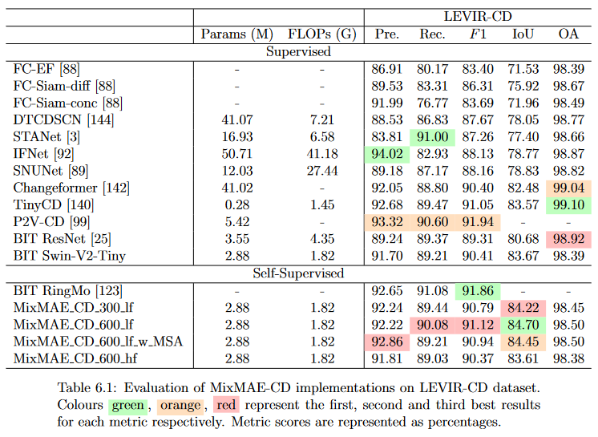

# Masters Thesis: Compute Limited Self-Supervised Learning with Transformers for Change Detection

MSc Computer Science (Artificial Intelligence) - University of Galway

## About <a name = "about"></a>

This project involves the use of a novel self-supervised learning approach for remote sensing change detection. The project aims are:

1. Determine if SSL helps learn feature representations that are useful for CD and if it helps improve performance over supervised learning methods.
2. Investigate the use of SSL for enhancing the temporal modelling ability of existing CD methods.
3. Determine the feasibility of applying transformers using SSL with limited computational resources.  

Our proposed self-supervised method achieves improved performance on the change detection task over using a supervised only approach. We achieve results comparable with other state-of-the-art implementations while using a model with fewer parameters. We also show that our method uses far less data for pretraining that other self-supervised methods, making it a more viable approach for users without access to large computational resources.



## Dataset <a name = "dataset"></a>

You can find the original LEVIR-CD dataset at:

LEVIR-CD: https://justchenhao.github.io/LEVIR/

The dataset needs to be structured as such:

```
"""
Change detection data set with pixel-level binary labels；
├─A
├─B
├─label
└─list
"""
```

`A`: images of t1 phase;

`B`:images of t2 phase;

`label`: label maps;

`list`: contains `train.txt, val.txt and test.txt`, each file records the image names (XXX.png) in the change detection dataset.

If you prefer, you can download the pre-processed dataset using the following:

LEVIR-CD 
```cmd
wget https://www.dropbox.com/s/h9jl2ygznsaeg5d/LEVIR-CD-256.zip
```

## Pretraining <a name = "Pretraining"></a>

To run pretraining using MixMAE-CD with the default model configuration on the LEVIR-CD dataset, run [main_pretrain.py](main_pretrain.py) directly:

```cmd
python main_pretrain.py \
    --batch_size 512 \
    --epochs 600 \
    --model 'mixmae_cd_tiny_swin_v2' \
    --input_size 64 \
    --mask_ratio 0.5 \
    --lr 1.5e-3 \
    --norm_pix_loss \
    --low_freq_target \
    --warmup_epochs 20 \
    --data_path 'path/to/your/dataset' \
    --log_dir 'MixMAE_CD_600_lf/log' \
    --output_dir 'MixMAE_CD_600_lf/ckpt' \
    --num_workers 4 \
    --device 'cuda'
```

## Finetuning <a name = "finetuning"></a>

To run finetuning with the MixMAE-CD pretrained model, run [main_cd](main_cd.py):

```cmd
python main_cd.py \
    --project_name 'MixMAE_CD_600_lf' \
    --checkpoint_root 'checkpoint' \
    --num_workers 4 \
    --dataset 'LEVIR' \
    --data_name 'path/to/your/dataset' \
    --batch_size 8 \
    --img_size 256 \
    --net_G 'mixmae_cd_tiny_swin_v2' \
    --loss 'ce' \
    --max_epochs 100 \
    --backbone_ckpt 'MixMAE_CD_600_lf/ckpt/checkpoint.pth'
```

## References <a name = "references"></a>

- https://github.com/Sense-X/MixMIM
- https://github.com/justchenhao/BIT_CD
- https://github.com/wgcban/ChangeFormer for the pre-processed LEVIR-CD dataset.

## License <a name = "license"></a>

This project is licensed under the Apache License - see the [LICENSE](LICENSE) file for details.
